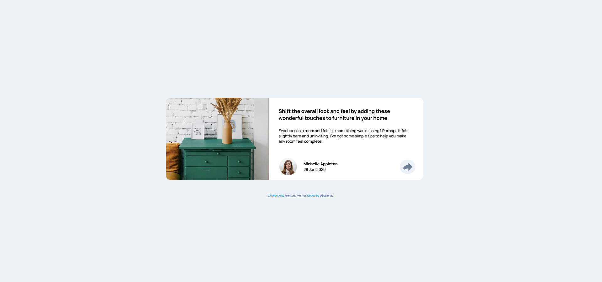

# Frontend Mentor - Article preview component solution

This is a solution to the [FAQ accordion card challenge on Frontend Mentor](https://www.frontendmentor.io/challenges/article-preview-component-dYBN_pYFT).

## Table of contents

- [Overview](#overview)
  - [The challenge](#the-challenge)
  - [Screenshot](#screenshot)
  - [Links](#links)
- [My process](#my-process)
  - [Built with](#built-with)
  - [What I learned](#what-i-learned)
  - [Continued development](#continued-development)
- [Author](#author)
- [Acknowledgments](#acknowledgments)

## Overview

### The challenge

- View the optimal layout for the component depending on their device's screen size
- See the social media share links when they click the share icon

### Screenshot

### Links

- Solution URL: (https://github.com/Darionas/article-preview-component-grid)
- Live Site URL: (https://darionas.github.io/article-preview-component-grid/)

## My process

* Set HTML layout:
* Create CSS external file to set style for HTML layout:
  * To achieve responsive web design set grid layout module:
     * Create first for mobile;
     * Later for desktop;
* Create external JavaScript file.

### Built with

It is based on:

- HTML
- CSS (grid layout module)
- JavaScript

But created with love.

### What I learned

In this challange I learned:

- Use tooltip in grid layout.

### Continued development

- Grid layout module.
- JavaScript.

## Author

- Frontend Mentor - [@Darionas](https://www.frontendmentor.io/profile/Darionas)

## Acknowledgments

- Thank you Frontend Mentor team for opportunity to try, practice, train yourself in different level challenges and gain invaluable experience.
- Thank you @Vikram from Frontend Mentor for guidance.
