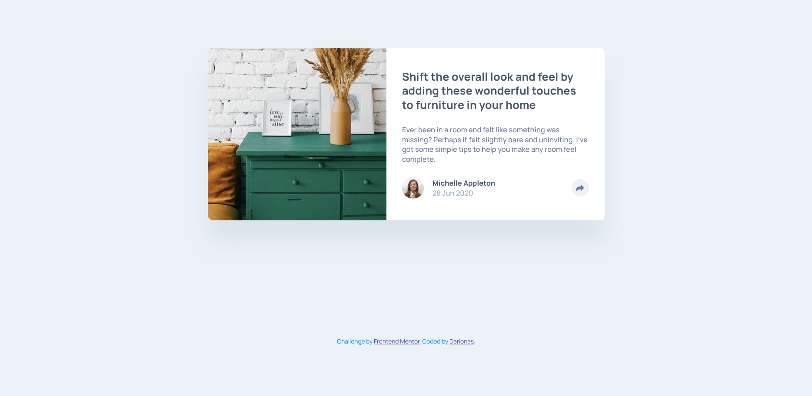

# Frontend Mentor - Article preview component solution

This is a solution to the [Article preview component challenge on Frontend Mentor](https://www.frontendmentor.io/challenges/article-preview-component-dYBN_pYFT). Frontend Mentor challenges help you improve your coding skills by building realistic projects.


## Table of contents

- [Overview](#overview)
  - [The challenge](#the-challenge)
  - [Screenshot](#screenshot)
  - [Links](#links)
- [My process](#my-process)
  - [Built with](#built-with)
  - [What I learned](#what-i-learned)
  - [Continued development](#continued-development)
  - [Useful resources](#useful-resources)
  - [AI Collaboration](#ai-collaboration)
- [Author](#author)
- [Acknowledgments](#acknowledgments)


## Overview

### The challenge

Your users should be able to:

- See the social media share links when they click the share icon
- View the optimal layout for each page depending on their device's screen size
- See hover states for all interactive elements on the page


### Screenshot




### Links

- Solution URL: [article preview component solution](https://github.com/Darionas/article-preview-component-grid)
- Live Site URL: [article preview component live site](https://darionas.github.io/article-preview-component-grid/)

## My process

### Built with

- Semantic HTML5 markup
- CSS custom properties
- Flexbox
- CSS Grid
- Mobile-first workflow
- JavaScript

But created with :heart:

### What I learned

I have learned to make arrow at the bottom of share Toast. I made the triangle using clip-path property, rotated and sit it at the bottom center of share Toast container, and colored it:

```
 .shareToast__content--open {
        display: flex;
        position: absolute;
        right: -75px;
        bottom: 100px;
        padding: 1.6em 2.4em;
        border-radius: 10px;
        max-width: 15em;
    }

    .shareToast__content--open::after {
        content: '';
        position: absolute;
        bottom: -10px;
        left: 50%;
        transform: translateX(-50%) rotate(180deg);
        width: 1rem;
        height: 0.7rem;
        background-color: var(--clr-grey-900);
        clip-path: polygon(50% 0%, 0% 100%, 100% 100%);
    }

```

### Continued development

I am taking part in My learning path on Frontend mentor.

### Useful resources

- [Share Toast arrow](https://www.youtube.com/watch?v=a5zSZ7Rk3xw) - This helped me to create triangle - arrow for share Toast container.


### AI Collaboration

I used GitHub Copilot. Mostly I used for debugging and for brainstorming. It is very handy tool. It let me to writte shorter, cleaner code. 

## Author

- Frontend Mentor - [@Darionas](https://www.frontendmentor.io/profile/Darionas)
- GitHub - [Darionas](https://github.com/Darionas)

## Acknowledgments

- Thank you to all Frontend Mentor team for opportunity to try, practice, train yourself in different level challenges and gain invaluable experience.
- Thank you to all supporters to inspire me to keep improving and coding. 
